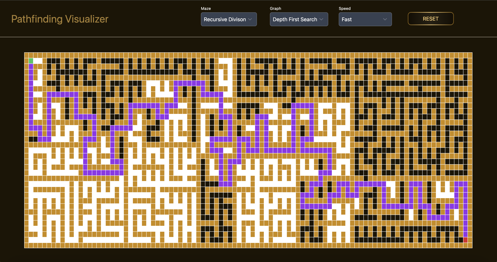

# 🚀 PathFinder

<div align="center">
  




### 🎮 Interactive Pathfinding Visualization
Watch algorithms come to life as they navigate through custom mazes!

</div>

## 🌟 About PathFinder

PathFinder is an innovative project designed to help users navigate and discover optimal paths in various contexts. Whether you're looking for the best route, the most efficient solution, or the perfect path to your goals, PathFinder is here to guide you.

## ✨ Features

- 🗺️ Intelligent path finding algorithms (DFS, BFS, A*, Dijkstra)
- 🎯 Customizable search parameters and maze generation
- 📊 Real-time visualization with adjustable speed
- 🔄 Dynamic path updates and interactive grid
- 🎨 Beautiful and intuitive dark-themed interface

## 🛠️ Tech Stack

- **Frontend**: React.js
- **Backend**: Node.js
- **Database**: MongoDB
- **Styling**: Tailwind CSS
- **Deployment**: Vercel/Netlify

## 🚀 Getting Started

### Prerequisites

- Node.js (v14 or higher)
- npm or yarn
- Git

### Installation

1. Clone the repository:
```bash
git clone https://github.com/Saintkumbi/Pathfinder.git
cd Pathfinder
```

2. Install dependencies:
```bash
npm install
# or
yarn install
```

3. Start the development server:
```bash
npm run dev
# or
yarn dev
```

## 🎯 Usage

1. **Select a Maze Algorithm**: Choose from various maze generation algorithms like Recursive Division
2. **Pick a Pathfinding Algorithm**: Select between Depth First Search, Breadth First Search, and more
3. **Adjust Speed**: Control the visualization speed from slow to fast
4. **Watch it Work**: See the algorithm navigate through the maze in real-time
5. **Reset & Repeat**: Try different combinations of mazes and algorithms!

## 🤝 Contributing

We welcome contributions! Please feel free to submit a Pull Request. For major changes, please open an issue first to discuss what you would like to change.

## 📝 License

This project is licensed under the MIT License - see the [LICENSE](LICENSE) file for details.

## 👥 Authors

- **Saint Kumbi** - *Initial work* - [Saintkumbi](https://github.com/Saintkumbi)

## 🙏 Acknowledgments

- Thanks to all contributors who have helped shape this project
- Special thanks to the open-source community

---

<div align="center">
  
Made with ❤️ by [Saint Kumbi](https://github.com/Saintkumbi)

</div>
